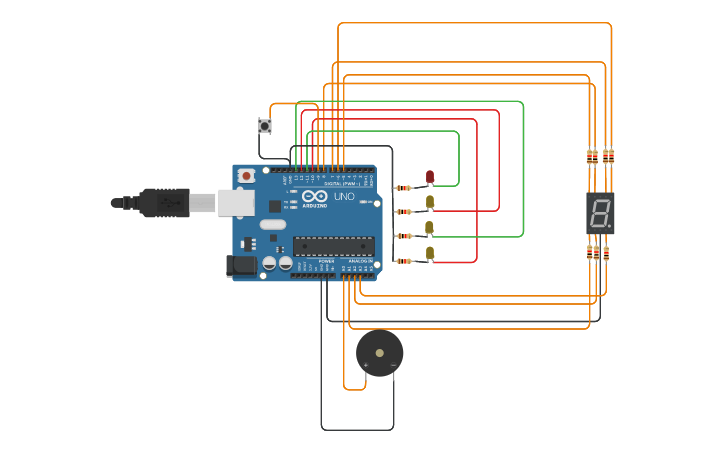

# 2do Dojo

## integrantes
- Angel Zabala

## Proyecto: Estacion del subte
Sistema que permita al usuario saber a qué estación de subte está
llegando

## Funcion principal
Esta funcion se encarga de imprimir por pantalla la estacion en la que esta y cual es la proxima

opcion es el mensaje a imprimir

~~~ C
void imprimirMensaje(int opcion)
{
  switch(opcion)
  {
   case 1:
   Serial.println("Estacion: Constitucion");
   Serial.println("Proxima estacion: San Juan");
   break;
   case 2:
   Serial.println("Estacion: San Juan");
   Serial.println("Proxima estacion: Independencia");
   break;
   case 3:
   Serial.println("Estacion: Independencia");
   Serial.println("Proxima estacion: Moreno");
   break;
   case 4:
   Serial.println("Estacion: Moreno");
   Serial.println("Estacion terminal");
   break;
   case 5:
   Serial.println("Estacion: Moreno");
   Serial.println("Proxima estacion: Independencia");
   break;
   case 6:
   Serial.println("Estacion: Independencia");
   Serial.println("Proxima estacion: San Juan");
   break;
   case 7:
   Serial.println("Estacion: San Juan");
   Serial.println("Proxima estacion: Constitucion");
   break;
   case 8:
   Serial.println("Estacion: Constitucion");
   Serial.println("Estacion terminal");
   break;
  }
 }
~~~

# 🤖 Link al proyecto
- [proyecto] (https://www.tinkercad.com/things/dmRgks1O06D)
